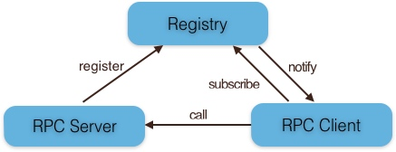
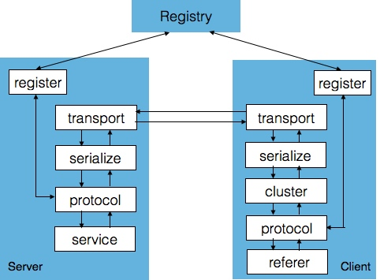
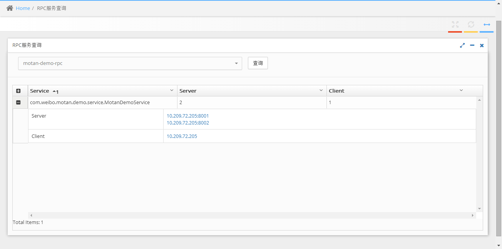
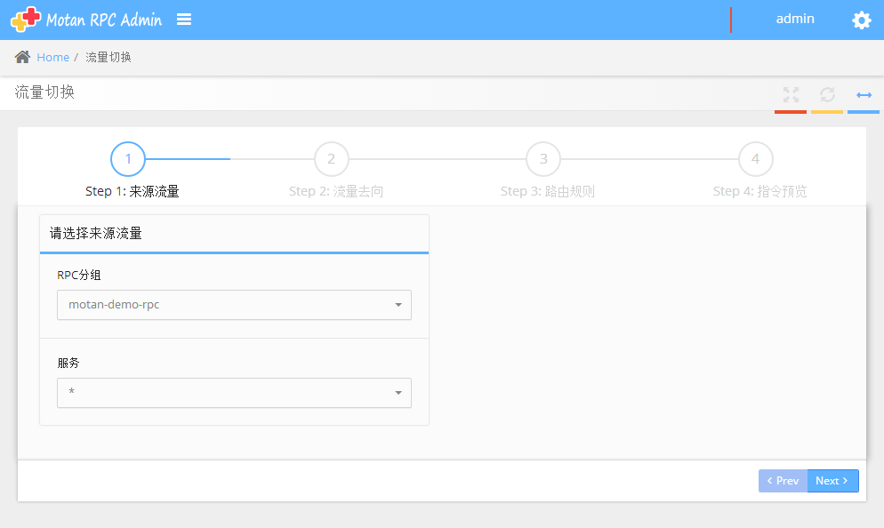
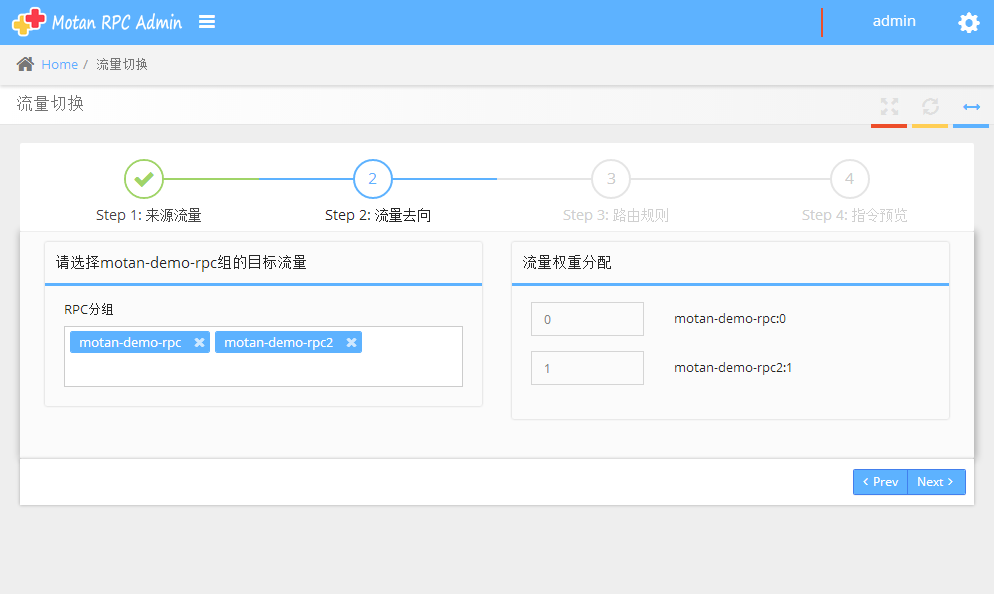
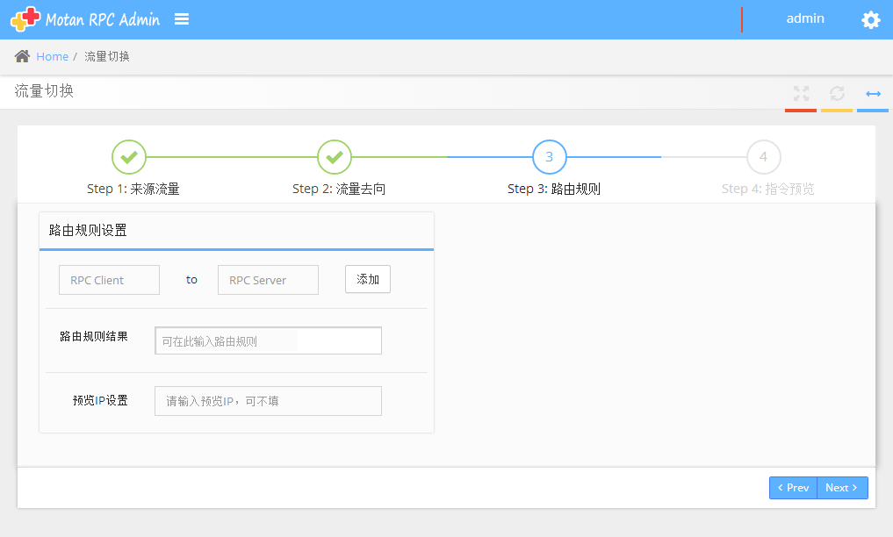
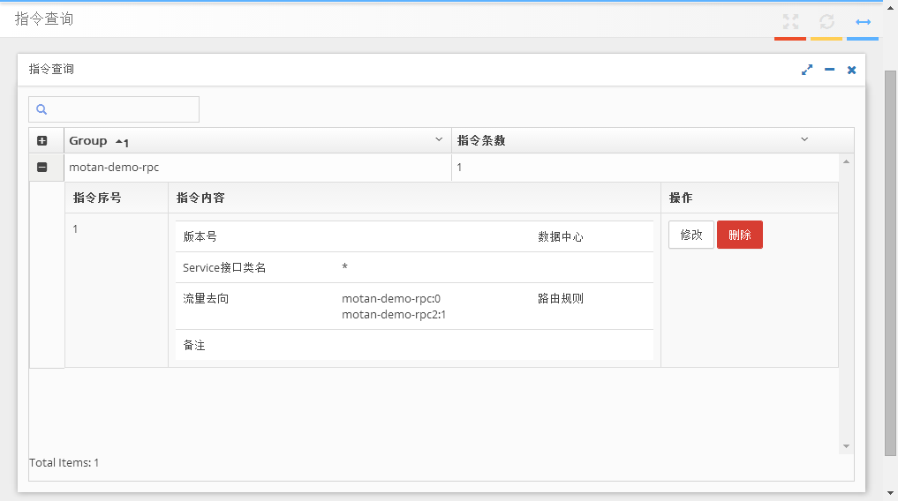
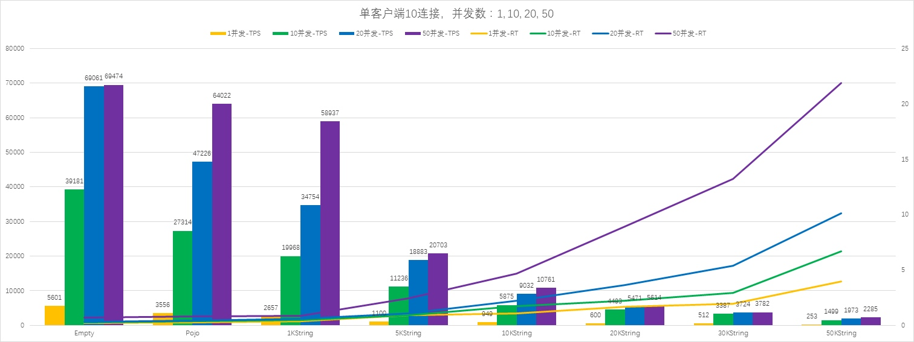

- [用户指南](#用户指南)
    - [基本介绍](#基本介绍)
        - [架构概述](#架构概述)
        - [模块概述](#模块概述)
        - [配置概述](#配置概述)
    - [使用Motan](#使用motan)
        - [工程依赖](#工程依赖)
        - [处理调用异常](#处理调用异常)
    - [配置说明](#配置说明)
        - [协议与连接](#协议与连接)
        - [注册中心与服务发现](#注册中心与服务发现)
        - [服务提供方](#服务提供方)
        - [服务调用方](#服务调用方)
        - [配置清单](#配置清单)
    - [运维及监控](#运维及监控)
        - [优雅的停止服务](#优雅的停止服务)
        - [管理后台](#管理后台)
        - [日志说明](#日志说明)
    - [性能测试](#性能测试)


# 基本介绍
Motan是一套基于java开发的RPC框架，除了常规的点对点调用外，Motan还提供服务治理功能，包括服务节点的自动发现、摘除、高可用和负载均衡等。Motan具有良好的扩展性，主要模块都提供了多种不同的实现，例如支持多种注册中心，支持多种rpc协议等。

## 架构概述

Motan中分为服务提供方(RPC Server)，服务调用方(RPC Client)和服务注册中心(Registry)三个角色。

* Server提供服务，向Registry注册自身服务，并向注册中心定期发送心跳汇报状态；
* Client使用服务，需要向注册中心订阅RPC服务，Client根据Registry返回的服务列表，与具体的Sever建立连接，并进行RPC调用。
* 当Server发生变更时，Registry会同步变更，Client感知后会对本地的服务列表作相应调整。

三者的交互关系如下图：



## 模块概述

Motan框架中主要有register、transport、serialize、protocol几个功能模块，各个功能模块都支持通过SPI进行扩展，各模块的交互如下图所示：




#### register
用来和注册中心进行交互，包括注册服务、订阅服务、服务变更通知、服务心跳发送等功能；Server端会在系统初始化时通过register模块注册服务，Client端在系统初始化时会通过register模块订阅到具体提供服务的Server列表，当Server 列表发生变更时也由register模块通知Client。

#### protocol
用来进行RPC服务的描述和RPC服务的配置管理，这一层还可以添加不同功能的filter用来完成统计、并发限制等功能。

#### serialize
将RPC请求中的参数、结果等对象进行序列化与反序列化，即进行对象与字节流的互相转换；默认使用对java更友好的hessian2进行序列化。

#### transport
用来进行远程通信，默认使用Netty nio的TCP长链接方式。

#### cluster
Client端使用的模块，cluster是一组可用的Server在逻辑上的封装，包含若干可以提供RPC服务的Server，实际请求时会根据不同的高可用与负载均衡策略选择一个可用的Server发起远程调用。
	
在进行RPC请求时，Client通过代理机制调用cluster模块，cluster根据配置的HA和LoadBalance选出一个可用的Server，通过serialize模块把RPC请求转换为字节流，然后通过transport模块发送到Server端。

## 配置概述
Motan框架中将功能模块抽象为四个可配置的元素，分别为：

- protocol：服务通信协议。服务提供方与消费方进行远程调用的协议，默认为Motan协议，使用hessian2进行序列化，netty作为Endpoint以及使用Motan自定义的协议编码方式。

- registry：注册中心。服务提供方将服务信息（包含ip、端口、服务策略等信息）注册到注册中心，服务消费方通过注册中心发现服务。当服务发生变更，注册中心负责通知各个消费方。

- service：服务提供方提供的服务。使用方将核心业务抽取出来,作为独立的服务。通过暴露服务并将服务注册至注册中心,从而使调用方调用。

- referer：服务消费方对服务的引用，即服务调用方。

Motan推荐使用spring配置rpc服务，目前Motan扩展了6个自定义Spring xml标签：

* motan:protocol
* motan:registry
* motan:basicService
* motan:service
* motan:basicReferer
* motan:referer

每种标签的详细含义请参考后文[配置说明](#config)部分。全部参数清单请参考[配置清单](zh_configuration)。

# 使用Motan
Motan主要使用Spring进行配置，业务代码无需修改。关于在项目中使用Motan框架的具体步骤，请参考：[快速入门](zh_quickstart)。

在使用Motan框架时，除了配置之外还需要注意工程依赖及Motan框架本身的异常处理。

## 工程依赖

Motan框架采用模块化设计，使用时可以按需依赖。目前的模块有：

* motan-core	
  Motan核心框架
* motan-transport-netty  
  基于Netty协议的长连接传输协议
* motan-registry-consul	  
  Consul服务发现组件
* motan-registry-zookeeper  
  Zookeeper服务发现组件
* motan-springsupport  
  Spring标签解析相关功能

## 处理调用异常

* 业务代码异常  
当调用的远程服务出现异常时，Motan会把Server业务中的异常对象抛出到Client代码中，与本地调用逻辑一致。

    > 注意:如果业务代码中抛出的异常类型为Error而非Exception（如OutOfMemoryError），Motan框架不会直接抛出Error，而是抛出包装了Error的MotanServiceException异常。

* MotanServiceException  
使用Motan框架将一个本地调用改为RPC调用后，如果出现网络问题或服务端集群异常等情况，Motan会在Client调用远程服务时抛出MotanServiceException异常，业务方需要自行决定后续处理逻辑。

* MotanFrameworkException  
	框架异常，比如系统启动、关闭、服务暴露、服务注册等非请求情况下出现问题，Motan会抛出此类异常。

# 配置说明

## 协议与连接（motan:protocol)

### 介绍

Protocol用来配置Motan服务的协议。不同的服务适用不同的协议进行传输，可以自行扩展协议。

### Motan协议

```xml
<motan:protocol name="motan" />
```

Motan默认的rpc协议为Motan协议，使用tcp长连接模式，基于netty通信。


#### 负载均衡

Motan 在集群负载均衡时，提供了多种方案，缺省为 ActiveWeight，并支持自定义扩展。
负载均衡策略在Client端生效，因此需在Client端添加配置

目前支持的负载均衡策略有：

- ActiveWeight(缺省)

    ```
    <motan:protocol ... loadbalance="activeWeight"/>
    ```
	低并发度优先： referer 的某时刻的 call 数越小优先级越高  
	由于 Referer List 可能很多，比如上百台，如果每次都要从这上百个 Referer 或者最低并发的几个，性能有些损耗，因此 random.nextInt(list.size()) 获取一个起始的 index，然后获取最多不超过 MAX_REFERER_COUNT 的状态是 isAvailable 的 referer 进行判断 activeCount.

- Random

    ```
    <motan:protocol ... loadbalance="random"/>
    ```
	随机，按权重设置随机概率。  
	在一个截面上碰撞的概率高，但调用量越大分布越均匀，而且按概率使用权重后也比较均匀，有利于动态调整提供者权重。

- RoundRobin

    ```
    <motan:protocol ... loadbalance="roundrobin"/>
    ```

    轮循，按公约后的权重设置轮循比率

- LocalFirst

    ```
    <motan:protocol ... loadbalance="localFirst"/>
    ```
	 本地服务优先获取策略，对referers根据ip顺序查找本地服务，多存在多个本地服务，获取Active最小的本地服务进行服务。  
    当不存在本地服务，但是存在远程RPC服务，则根据ActivWeight获取远程RPC服务  
    当两者都存在，所有本地服务都应优先于远程服务，本地RPC服务与远程RPC服务内部则根据ActiveWeight进行
	
- Consistent
 
    ```
    <motan:protocol ... loadbalance="consistent"/>
    ```
    一致性 Hash，相同参数的请求总是发到同一提供者

- ConfigurableWeight

    ```
    <motan:protocol ... loadbalance="configurableWeight"/>
    ```
    权重可配置的负载均衡策略

#### 容错策略

Motan 在集群调用失败时，提供了两种容错方案，并支持自定义扩展。
高可用集群容错策略在Client端生效，因此需在Client端添加配置
目前支持的集群容错策略有：

- Failover 失效切换（缺省）

    ```
    <motan:protocol ... haStrategy="failover"/>
    ```
    失败自动切换，当出现失败，重试其它服务器。

- Failfast 快速失败

    ```
    <motan:protocol ... haStrategy="failfast"/>
    ```
    快速失败，只发起一次调用，失败立即报错。

#### 连接控制

* 限制服务端连接池工作线程数

    ```
    <motan:protocol id="demoMotan" name="motan" maxWorkerThread="800" minWorkerThread="20"/>
    ```

* 限制客户端对每个服务建立的连接数

    ```
    <motan:protocol name="motan" maxClientConnection="10" minClientConnection="2"/>
    ```
	

### 本地调用

	<motan:protocol name="injvm" />

Injvm 协议是一个伪协议，它不开启端口，不发起远程调用，只在 JVM 内直接关联，但执行 Motan 的 Filter 链。

## 注册中心与服务发现(motan:registry)
### 介绍

注册中心配置。用于配置注册中心的注册协议、地址端口、超时时间等。motan:registry包含以下常用属性：

* name：标识配置名称
* regProtocol：标识注册中心协议
* address：标识注册中心地址

Motan支持使用多种Registry模块，使用不同注册中心需要依赖对应jar包。

### 使用Consul作为注册中心

```xml
<motan:registry regProtocol="consul" name="my_consul" address="consul_port:port"/>
```   
	
### 使用Zookeeper作为注册中心

 zookeeper为单节点  
    
    ```xml
    <motan:registry regProtocol="zookeeper" name="my_zookeeper" address="zookeeper_ip1:port"/>
    ```
    
    zookeeper多节点集群  

    ```xml
    <motan:registry regProtocol="zookeeper" name="my_zookeeper" address="zookeeper_ip1:port1,zookeeper_ip2:port2,zookeeper_ip3:port"/>
    ```
    
### 不使用注册中心

在开发及测试环境下，经常需要绕过注册中心，只测试指定服务提供者，这时候可能需要点对点直连，点对点直联方式:

```xml
<motan:registry regProtocol="direct" name="directRegistry" port="8002" address="192.168.1.2" />
```
or
```
<motan:registry regProtocol="direct" name="directRegistry" address="192.168.1.2:8002,192.168.1.3:8002" />
```

## 服务提供方(motan:service)
### 介绍
定义提供给外部调用的接口，motan:service包含以下常用属性：

* interface：标识服务的接口类名
* ref：标识服务的实现类，引用具体的spring业务实现对象
* export：标识服务的暴露方式，格式为“protocolId:port”（使用的协议及对外提供的端口号），其中protocolId：应与motan:protocol中的id一致
* group：标识服务的分组
* module：标识模块信息	
* basicService：标识使用的基本配置，引用motan:basicService对象

Motan在注册中心的服务是以group的形式保存的，一般推荐一个分组以机房＋业务线进行命名，如yf-user-rpc。一个分组中包含若干的Service，一个Service即是java中的一个接口类名，每个Service下有一组能够提供对应服务的Server。


### 使用basicService简化配置

```xml
<motan:basicService .../>
```

rpc服务的通用配置，用于配置所有服务接口的公共配置，减少配置冗余。basicService包含以下常用属性：

* id：标识配置项
* export：标识服务的暴露方式，格式为“protocolId:port”（使用的协议及对外提供的端口号），其中protocolId：应与motan:protocol中的id一致
* group：标识服务的分组
* module：标识模块信息
* registry：标识service使用的注册中心，与motan:registry中的name对应

motan:service可以通过以下方式引用基本配置。

```
<!-- 通用配置，多个rpc服务使用相同的基础配置. group和module定义具体的服务池。export格式为“protocol id:提供服务的端口” -->
<motan:basicService id="serviceBasicConfig" export="demoMotan:8002" group="motan-demo-rpc" module="motan-demo-rpc" registry="registry"/>
<!-- 通用配置，多个rpc服务使用相同的基础配置. group和module定义具体的服务池。export格式为“protocol id:提供服务的端口” -->
<motan:service interface="com.weibo.motan.demo.service.MotanDemoService" ref="demoServiceImpl" basicService="serviceBasicConfig"/>
```

motan:service中的basicService属性用来标识引用哪个motan:basicService对象，对于basicService中已定义的内容，service不必重复配置。


## 服务调用方(motan:referer)
### 介绍

调用方对象，motan:referer包含以下常用属性：

* id：标识配置项
* group：标识服务的分组
* module：标识模块信息
* protocol：标识referer使用的协议，与motan:protocol中的name对应，默认为Motan协议
* registry：标识referer使用的注册中心，与motan:registry中的name对应
* basicReferer：标识使用的基本配置，引用motan:basicReferer对象

Client端订阅Service后，会从Registry中得到能够提供对应Service的一组Server，Client把这一组Server看作一个提供服务的cluster。当cluster中的Server发生变更时，Client端的register模块会通知Client进行更新。


### 使用basicReferer简化配置
调用方基础配置。用于配置所有服务代理的公共属性。

* id：标识配置项
* group：标识服务的分组
* module：标识模块信息
* protocol：标识referer使用的协议，与motan:protocol中的name对应，默认为Motan协议
* registry：标识referer使用的注册中心，与motan:registry中的name对应

motan:referer可以通过以下方式引用基本配置。

```
<!-- 通用referer基础配置 -->
<motan:basicReferer id="clientBasicConfig" group="motan-demo-rpc" module="motan-demo-rpc"  registry="registry" protocol="motan"/>

<!-- 具体referer配置。使用方通过beanid使用服务接口类 -->
<motan:referer id="demoReferer" interface="com.weibo.motan.demo.service.MotanDemoService"  basicReferer="clientBasicConfig"/>
```
motan:referer中的basicService属性用来标识引用哪个motan:basicReferer对象，对于basicReferer中已定义的内容，service不必重复配置。

## 配置清单
详细内容请参考[配置清单](zh_configuration)

# 运维及监控
## 优雅的停止服务
Motan支持在Consul、ZooKeeper集群环境下优雅的关闭节点，当需要关闭或重启节点时，可以先将待上线节点从集群中摘除，避免直接关闭影响正常请求。

待关闭节点需要调用以下代码，建议通过servlet或业务的管理模块进行该调用。

```java
MotanSwitcherUtil.setSwitcherValue(MotanConstants.REGISTRY_HEARTBEAT_SWITCHER, false)
```

## 管理后台
管理后台主要包括RPC服务查询、流量切换、Motan指令设置等功能，需使用ZooKeeper作为注册中心

管理后台独立于Motan其他部分，可单独部署
### 管理后台安装
1. 配置
    
    修改配置文件config.properties，配置注册中心类型（zookeeper, consul）及注册中心地址，默认不使用数据库
    
    默认的登录用户及权限如下：
        管理员：用户名admin 密码admin
        访客：用户名guest 密码guest
    
    若需使用历史操作查询功能，则需配置数据库：
        数据库表结构位于motan-manager.sql，可直接导入
        数据库配置地址位于config.properties
        在WEB-INF/web.xml的contextConfigLocation中添加classpath*:spring-mybaits.xml

2. 启动
    
    在motan-open/motan-manager/下执行mvn install
    将motan-open/motan-manager/target/motan-manager.war部署到任意web容器中（如：tomcat的webapps目录下），运行web容器即可
    
### 管理后台使用
#### RPC服务查询
    
查询指定group的所有service状态，包括正常提供服务的Server和正在调用的Client

注：Consul注册中心暂不支持Client查询

步骤：
    
- 在导航栏选择`RPC服务查询`，进入RPC服务查询页面

- 下拉列表中选择要查询的服务所在的分组，如`motan-demo-rpc`，点击`查询`按钮


    
#### 流量切换（需要管理员权限）

对指定服务根据分组或ip地址进行动态流量调整

步骤：

以下示例演示将来自`motan-demo-rpc`分组中`所有服务`的流量切换到`motan-demo-rpc2`分组中

- 在导航栏选择`流量切换`，进入流量切换页面

- Step1：

    来源流量的`RPC分组`列表中选择需要切换流量的Service所在的分组，如`motan-demo-rpc`

    `服务`列表中`*`表示所有服务，也可输入服务名称，语法见[服务名语法](#服务名语法)，点击`Next`

    

- Step2: 

    目标流量的`RPC分组`列表中选择目标流量分组，如`motan-demo-rpc2`，

    流量权重分配中根据需要按比例分配（可选范围是[0,100]），这里输入`0`和`1`，表示将来自`motan-demo-rpc`的流量全部转入`motan-demo-rpc2`，点击`Next`

    

- Step3：（可选）若需根据具体IP调整流量，可在此配置

    `RPC Client`中输入来源流量的ip，`RPC Server`中输入目标流量的ip，点击`添加`后将在`路由规则结果`中显示

    也可在`路由规则结果`中手动输入路由规则，路由规则见[路由规则语法](#路由规则语法)，点击`Next`

    

- Step4：指令预览

    功能暂未启用，点击`Finish`完成流量切换操作

##### 服务名语法

- 类名支持`[a-zA-Z0-9_$.*]`
- 运算符支持 `()` `!` `&` `|`，优先级由高到低
- 复杂示例如下

    ```
    (com.weibo.User* & !com.weibo.UserMapping) | com.weibo.Status*
    # 匹配com.weibo下以User开头的不包括UserMapping的所有服务，或以Status开头的所有服务
    ```

##### 路由规则语法

- 必须包含`to`关键字，to左右两边分别为rpc client和rpc server的ip表达式，示例如下
  
    ```
    * to 10.75.1.*
    10.75.2.* to 10.73.1.*
    * to !10.75.1.1
    ```
    
#### 指令管理

对注册中心下的所有指令信息进行增删改查操作

步骤：
    
- 在导航栏选择`指令查询`，进入指令查询页面

- 指令`修改`和`删除`操作需要管理员权限
    
    

#### 操作记录查询（需要管理员权限）
    
查询指令增删改查记录

步骤：
    
- 在导航栏选择`操作记录查询`，进入操作记录查询

## 日志说明
Motan会打印两种类型的日志，帮助运维人员监控系统状态。

### 请求类日志

通过motan:service或motan:referer的accessLog属性来配置，基本格式如下：

	"accesslog" - date - side - local_application_module - localip - interface - method_name - parameter_name - to_ip - remote_application_module - result - request_id - process_time_mills (分隔符为"|"）

### 异常类日志

请参考 [错误码及异常日志说明](zh_errorcode)。

### 统计类日志

所有请求的统计：

	[motan-totalAccessStatistic] total_count: 32565 slow_count: 26 biz_excp: 0 other_excp: 2 avg_time: 1.93ms biz_time: 0.94ms avg_tps: 1085
	total_count: 30s 内总请求数
	slow_count：30s 内慢请求数（超过 50ms 算 slow）
	biz_excp: 30s 内业务处理异常的总数
	other_excp: 30s 其他异常的总数
	avg_time: 所有接口的平均响应时间(网络传输+序列化+service 端处理)
	biz_time: 所有接口的 service 端的业务处理时间(不包含序列化和网络传输）
	avg_tps：平均 tps
	注：上面是基于 client 端为维度的统计，service 端也有，其中 avg_time 便是业务处理时间，biz_time 为 0。

单方法的统计：

	[motan-accessStatistic] item: injvm://cn.sina.api.data.service.GroupService.getGroupMemberCounters(long,long) total_count: 0 slow_count: 0 biz_excp: 0 other_excp: 0 avg_time: 0.00ms biz_time: 0.00ms avg_tps: 0 max_tps: 0 min_tps: 0
	total_count: 30s 该接口的请求数，
	slow_count: 30s 内该接口的慢请求数 （超过 50ms 的算 slow） ，
	biz_excp: 30s 内该接口业务处理异常的总数，
	other_excp: 30s 该接口其他异常的总数，
	avg_time: 平均响应时间(网络传输+序列化+service 端处理)，
	biz_time: service 端的业务处理时间(不包含序列化和网络传输） ，
	avg_tps：平均 tps，
	max_tps: 最大的 TPS，
	min_tps: 最小的 TPS

内存统计：

	[motan-memoryStatistic] 1954.67MB of 7987.25 MB (24.5%) used
		
	
# 性能测试

Motan源码中提供了性能测试框架，便于使用者进行性能评估，源码请参考<https://github.com/weibocom/motan/tree/master/motan-benchmark>。

以下是我们测试的结果：

### 测试环境

#### 硬件配置
     
     Server端：
     CPU：model name:Intel(R) Xeon(R) CPU E5-2620 v2 @ 2.10GHz,cache size: 15360 KB,processor_count : 24
     内存：16G
     网络：千兆网卡
     硬盘：300GB
     
     Client端：
     CPU：model name: Intel(R) Xeon(R) CPU E5-2620 v2 @ 2.10GHz,cache size:15360 KB,processor_count : 24
     内存：16G
     网络：千兆网卡
     硬盘：300GB
     
#### 软件配置
     
     JDK版本：
     java version "1.7.0_75"
     OpenJDK Runtime Environment (rhel-2.5.4.2.el7_0-x86_64 u75-b13)
     OpenJDK 64-Bit Server VM (build 24.75-b04, mixed mode)
     
     JVM参数：
     java -Djava.net.preferIPv4Stack=true -server -Xms1g -Xmx1g -XX:PermSize=128m

### 测试脚本
    
#### Server测试场景：
    
    并发多个Client，连接数50，并发数100，测试Server极限性能
    
#### Client测试场景：
    
    单客户端，10连接，在并发数分别为1，10，20，50的情况下，分别进行如下场景测试：
    - 传入空包，不做任何处理，原样返回
    - 传入Pojo嵌套对象，不做任何处理，原样返回
    - 传入1kString，不做任何处理，原样返回
    - 传入5kString，不做任何处理，原样返回
    - 传入10kString，不做任何处理，原样返回
    - 传入20kString，不做任何处理，原样返回
    - 传入30kString，不做任何处理，原样返回
    - 传入50kString，不做任何处理，原样返回。
    
### 测试结果
    
#### Server测试结果：

    请求空包：单Server极限TPS：18W
    请求1KString：单Server极限TPS：8.4W
    请求5KString：单Server极限TPS：2W
    
#### Client测试结果：

对比图：




原始数据：

| 并发数 | 测试场景  | 平均TPS | 平均响应时间(ms) |
|--------|-----------|---------|--------------|
| 1      | Empty     | 5601    | 0.178        |
| 1      | Pojo      | 3556    | 0.281        |
| 1      | 1KString  | 2657    | 0.376        |
| 1      | 5KString  | 1100    | 0.908        |
| 1      | 10KString | 949     | 1.052        |
| 1      | 20KString | 600     | 1.664        |
| 1      | 30KString | 512     | 1.95         |
| 1      | 50KString | 253     | 3.939        |
| 10     | Empty     | 39181   | 0.255        |
| 10     | Pojo      | 27314   | 0.365        |
| 10     | 1KString  | 19968   | 0.5          |
| 10     | 5KString  | 11236   | 0.889        |
| 10     | 10KString | 5875    | 1.701        |
| 10     | 20KString | 4493    | 2.224        |
| 10     | 30KString | 3387    | 2.951        |
| 10     | 50KString | 1499    | 6.668        |
| 20     | Empty     | 69061   | 0.289        |
| 20     | Pojo      | 47226   | 0.423        |
| 20     | 1KString  | 34754   | 0.575        |
| 20     | 5KString  | 18883   | 1.058        |
| 20     | 10KString | 9032    | 2.214        |
| 20     | 20KString | 5471    | 3.654        |
| 20     | 30KString | 3724    | 5.368        |
| 20     | 50KString | 1973    | 10.133       |
| 50     | Empty     | 69474   | 0.719        |
| 50     | Pojo      | 64022   | 0.78         |
| 50     | 1KString  | 58937   | 0.848        |
| 50     | 5KString  | 20703   | 2.414        |
| 50     | 10KString | 10761   | 4.645        |
| 50     | 20KString | 5614    | 8.904        |
| 50     | 30KString | 3782    | 13.214       |
| 50     | 50KString | 2285    | 21.869       |
